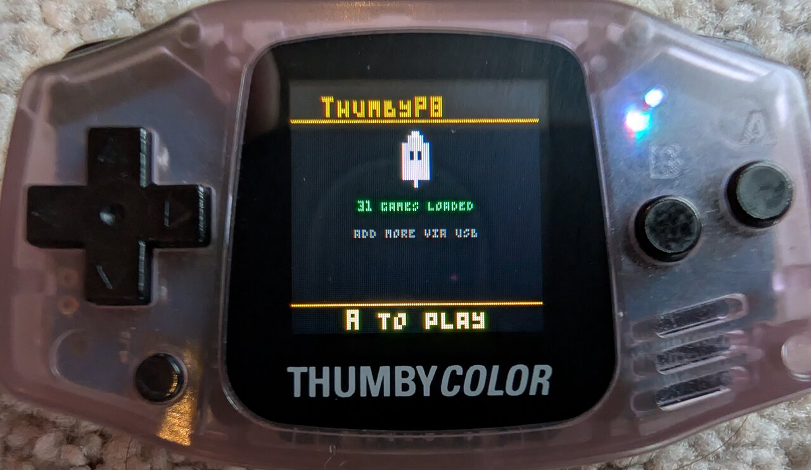
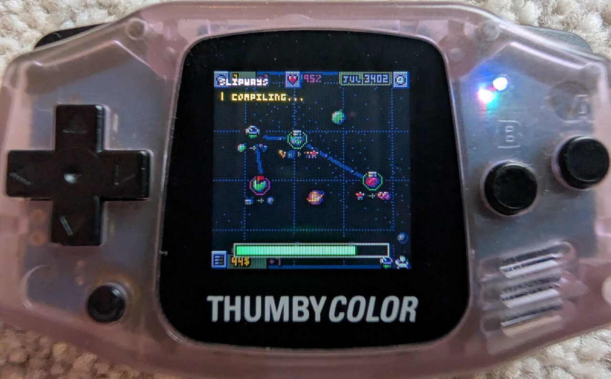
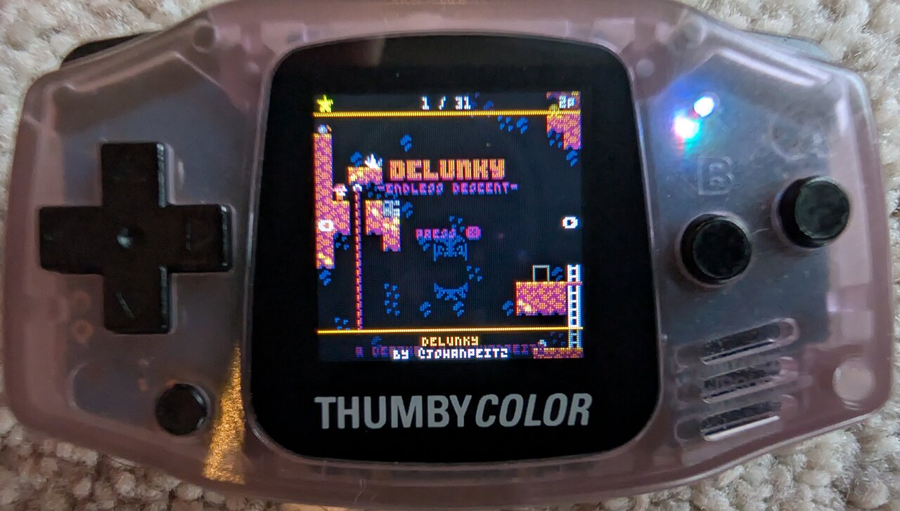
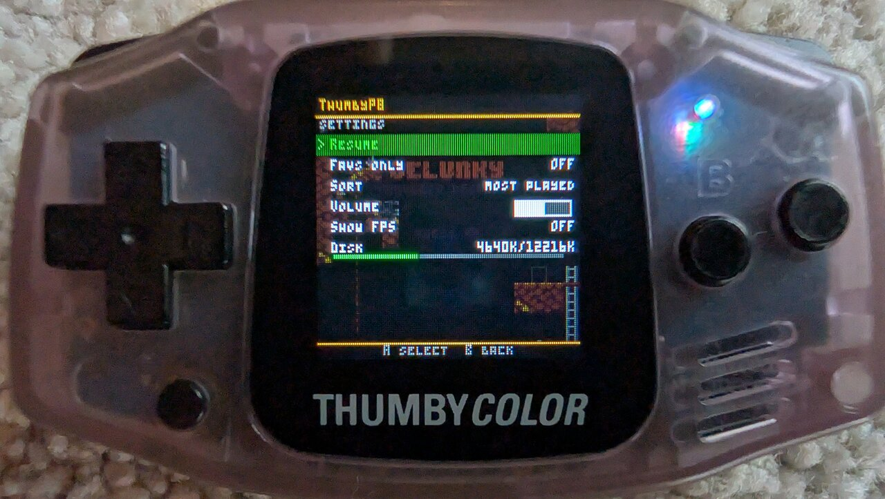

# ThumbyP8

A PICO-8-compatible fantasy console runtime for the **TinyCircuits Thumby Color** (RP2350 Cortex-M33, 128×128 RGB565 LCD, 4-channel audio, 520 KB SRAM, 16 MB flash).

Drop `.p8.png` cart files onto the USB drive — they are automatically converted and ready to play on next boot. No host tools required.

<p align="center">
  
  
</p>
<p align="center">
  <em>Celeste Classic and Delunky running on real hardware</em>
</p>

PICO-8 is a trademark of Lexaloffle Games. ThumbyP8 is an independent, clean-room reimplementation of the publicly documented PICO-8 fantasy console API.

---

## Quick Start

> **Please support the creators.** PICO-8 is an incredible fantasy console made by [Lexaloffle](https://www.lexaloffle.com/pico-8.php). If you enjoy playing PICO-8 games on your Thumby Color, please [buy PICO-8](https://www.lexaloffle.com/pico-8.php) ($15) to support the developers and the amazing community that makes these games. ThumbyP8 wouldn't exist without their work.

### 1. Flash the firmware

Download [`firmware_p8.uf2`](firmware_p8.uf2) from this repo (click the file, then "Download raw file").

> **Warning:** Flashing ThumbyP8 replaces whatever is currently on your Thumby Color (the stock MicroPython system, any games, etc). To go back, reflash the original Thumby Color firmware the same way.

To flash:
1. Power off the Thumby Color
2. Hold **DOWN** on the d-pad and power on — the device enters BOOTSEL mode
3. It appears as a USB drive called `RPI-RP2350` on your computer
4. Drag `firmware_p8.uf2` onto that drive
5. The device reboots automatically into ThumbyP8

### 2. Add carts

<p align="center">
  
</p>

On first boot (or if no carts are on the device), ThumbyP8 shows a lobby screen and appears as a USB drive labelled **P8THUMBv1**.

1. Download `.p8.png` cart files from the [PICO-8 BBS](https://www.lexaloffle.com/bbs/?cat=7) or elsewhere
2. Drag them into the `/carts/` folder on the P8THUMBv1 drive
3. Eject the drive from your OS (or just wait — it auto-flushes)
4. Press **A** to enter the picker (or reboot if new carts need converting)

Each `.p8.png` is automatically converted to playable bytecode at boot (one cart per reboot cycle, a few seconds each). The lobby always shows on boot so USB is available for adding more carts.

<p align="center">
  
</p>

### 3. Play

<p align="center">
  
</p>

Use **◀ ▶** in the picker to browse carts (shows the cart's label art). Press **A** to launch. The star icon marks favorites; the play count appears in the top-right.

#### Picker controls

| Input | Action |
|-------|--------|
| **◀ / ▶** | Previous / next cart |
| **A** | Launch selected cart |
| **B** (short tap) | Toggle favorite (⭐ shown top-left when active) |
| **B** (hold 5s) | Show DELETE CART warning overlay |
| **B** (hold 10s) | Delete cart and all sidecars (.luac, .rom, .bmp, .meta, .sav, .p8.png) |
| **MENU** (long-press) | Open picker settings menu |

Releasing **B** before 10 seconds cancels the delete.

#### Picker settings menu

<p align="center">
  
</p>

Long-press MENU from the picker to open:

| Item | Description |
|------|-------------|
| **Favs only** | Filter view to show only favorited carts |
| **Sort** | Cart order: alphabetical / favorites first / most played |
| **Volume** | Master audio volume (slider 0–30) |
| **Show FPS** | Toggle FPS counter overlay |
| **Disk** | Filesystem usage |

Favorites, play counts, filter state, sort mode, and last-selected cart all persist across reboots. Play count shows in the top-right corner of the picker when > 0.

### 4. In-game menu

<p align="center">
  
</p>

Long-press **MENU** (>400ms) during gameplay to open the pause menu:
- **Resume** — return to the game
- **Cart-registered items** — custom entries added via `menuitem()` (up to 5)
- **Volume** — master audio (slider)
- **Show FPS** — toggle FPS counter
- **Disk** / **Battery** — info displays
- **Quit to picker** — save settings and reboot back to the picker

Carts can register custom pause menu items via `menuitem(index, label, callback)`. The callback receives a button bitmask and can return `true` to keep the menu open.

**Quit to picker** does a full reboot — this ensures the Lua heap is fully reclaimed for the next cart, avoiding any chance of fragmentation or leaked state.

### 5. Troubleshooting

- **USB drive not showing up or not named P8THUMBv1?** Hold **MENU** while powering on — this forces a full reformat of the flash filesystem.
- **Cart conversion stuck?** Hold **B** while powering on to skip conversion.
- **Want to go back to the stock Thumby Color firmware?** Enter BOOTSEL (power off → hold DOWN → power on) and flash the original `.uf2`. The RP2350 boot ROM cannot be bricked — BOOTSEL always works.

---

## How It Works

### The Big Picture

When you drop a `.p8.png` onto the USB drive and reboot, here's what happens:

```
  .p8.png file on FAT filesystem
       │
       ▼
  ┌─────────────────────────────────────────────┐
  │  ON-DEVICE CONVERSION (runs at boot)        │
  │                                             │
  │  1. PNG decode (stb_image via file I/O)     │
  │  2. Steganographic byte extraction          │
  │  3. PXA Lua decompression                   │
  │  4. shrinko8 parse + unminify (C port)      │
  │  5. PICO-8 dialect → Lua 5.2 translation    │
  │  6. Lua 5.2 bytecode compilation            │
  │  7. Save .luac + .rom + .bmp to FAT         │
  │  8. Reboot (one cart per cycle)             │
  │                                             │
  └─────────────────────────────────────────────┘
       │
       ▼
  .luac (bytecode) + .rom (sprites/sfx/map) + .bmp (thumbnail)
       │
       ▼
  ┌─────────────────────────────────────────────┐
  │  GAME EXECUTION                             │
  │                                             │
  │  1. Program .luac + .rom into XIP flash     │
  │  2. Load bytecode directly from flash       │
  │     (Proto.code[] stays in XIP, not heap)   │
  │  3. Copy ROM into PICO-8 memory map         │
  │  4. Call _init(), then _update()/_draw()    │
  │     loop at 30 or 60 fps                    │
  │                                             │
  └─────────────────────────────────────────────┘
```

### Layer 1: The Conversion Pipeline

PICO-8 `.p8.png` carts steganographically encode 32 KB of data in the low 2 bits of each pixel of a 160×205 PNG. The data contains:
- **ROM** (0x0000–0x42FF): sprite sheet, sprite flags, map, SFX, music
- **Lua source** (0x4300–0x7FFF): compressed with PXA (move-to-front + Golomb-coded bitstream)

The conversion pipeline has three stages:

**Stage 1: PNG decode + PXA decompress** (`src/p8_p8png.c`)
- stb_image decodes the PNG via file I/O callbacks (no full PNG in heap — saves ~70KB)
- Cart bytes extracted from low 2 bits of RGBA pixels
- Thumbnail extracted from visible PNG pixels (128×128 crop at 16,24) → saved as BMP
- ROM bytes saved directly to `.rom` file
- PXA bitstream decompressed to raw PICO-8 Lua source

**Stage 2: shrinko8 unminify** (`src/p8_shrinko.c`)

A streaming C port of [shrinko8](https://github.com/thisismypassport/shrinko8) (MIT). This is a proper PICO-8 tokenizer + recursive-descent parser that handles minified source correctly (e.g. `j-=1return0nC()` → proper token boundaries). The streaming architecture uses ~90KB peak memory (no AST, no token array — the C call stack IS the parse tree).

The parser also converts PICO-8 fixed-point bitwise operators to function calls during emission:
- `a << b` → `shl(a, b)` / `a >> b` → `shr(a, b)`
- `a >>> b` → `lshr(a, b)` / `a <<> b` → `rotl(a, b)` / `a >>< b` → `rotr(a, b)`
- `a & b` → `band(a, b)` / `a | b` → `bor(a, b)` / `a ^^ b` → `bxor(a, b)`
- `~a` → `bnot(a)`

PICO-8 uses 16.16 fixed-point for all bitwise operations (`0.5 << 1 = 1.0`). Converting to function calls lets the runtime handle the fixed-point conversion correctly.

The unminifier also handles:
- Shorthand `if (cond) stmt` → `if cond then stmt end`
- Shorthand `while (cond) stmt` → `while cond do stmt end`
- `if cond do` → `if cond then`
- `? expr` print shorthand → `print(expr)`
- `// comments` → `-- comments`
- Proper whitespace insertion between tokens

**Stage 3: Dialect translation** (`src/p8_translate.c`)

Character-level transforms on the clean shrinko8 output:
- `\` → `p8idiv()` (integer divide — Lua 5.2 has no `//` operator)
- `@addr` → `peek(addr)`, `%addr` → `peek2(addr)`, `$addr` → `peek4(addr)`
- `0b1010` binary literals → decimal
- Button/arrow glyphs (⬅➡⬆⬇🅾❎) → button indices (0–5)
- P8SCII high bytes in code → numeric values
- String escape rewriting (`\^`, `\-`, etc. → `\xHH`)
- `;` before `(` at line start (Lua parser disambiguation)

Then a line-based rewriter expands compound assigns (`x += y` → `x = x + (y)`) and converts `!=` → `~=`.

**Stage 4: Compile** (`luaL_loadbuffer` + `lua_dump`)

The translated source is compiled to Lua 5.2 bytecode and dumped directly to a `.luac` file on the FAT filesystem (no intermediate heap buffer).

### Layer 2: The Lua Runtime

ThumbyP8 vendors **PUC Lua 5.2.4** (MIT) — the same Lua version PICO-8 is based on. This eliminates the integer/float distinction that caused widespread compatibility issues with Lua 5.3+. Configured with `LUA_NUMBER float` for single-precision (the RP2350's Cortex-M33 has a hardware single-precision FPU but no double FPU).

```
src/p8.c               ← Lua VM lifecycle + capped allocator
  │
  ▼
lua/                   ← Vendored Lua 5.2.4
├── lvm.c              ← Bytecode dispatch (the hot loop)
├── lparser.c          ← Parser → bytecode compiler
├── lgc.c              ← Garbage collector
├── lapi.c, ldo.c, llex.c, lstring.c, ltable.c, …
└── lbaselib.c, ltablib.c, lstrlib.c, lmathlib.c, lcorolib.c
```

**What runs as Lua bytecode** (interpreted by `lvm.c`):
- The cart's `_init`, `_update`/`_update60`, and `_draw` functions
- All game logic: entity systems, level generation, particles, AI, menus
- Everything the cart author wrote

**What runs as native C** (called from Lua via the C API):
- Every PICO-8 API binding in `src/p8_api.c` (~100 functions)
- Drawing primitives in `src/p8_draw.c` (line, rect, rrect, circ, oval, sprite blit, sspr, tline, tilemap, fillp, palette)
- Audio synth in `src/p8_audio.c` (4 channels, 8 waveforms, effects, music pattern advancement with loop/stop flags, fade in/out)
- Font rendering in `src/p8_font.c` (full P8SCII character set: ASCII 32–127 + glyphs 128–255)

**The boundary in practice:** When Celeste calls `circfill(64, 64, 8, 7)`:
1. Lua's `lvm.c` executes the CALL instruction
2. Jumps to C function `l_circfill` in `p8_api.c`
3. Which reads arguments from the Lua stack
4. Calls `p8_circfill` in `p8_draw.c`
5. Which writes pixels into the 4bpp framebuffer at `machine.mem[0x6000..]`
6. At frame end, `p8_machine_present` expands 4bpp → RGB565 into a scanline buffer
7. `p8_lcd_present` DMAs the buffer to the GC9107 LCD

**Performance:** Lua bytecode dispatch costs ~148 ns per instruction at 250 MHz. Carts do 10K–30K instructions per frame at 30 fps, so the interpreter uses ~1–4 ms of the 33 ms frame budget. Drawing and audio (pure C) dominate.

**Fixed-point bitwise operations:** PICO-8 uses 16.16 fixed-point for all bitwise ops. The runtime functions (`shl`, `shr`, `band`, `bor`, etc.) convert to/from fixed-point internally, operating on the 32-bit integer representation then converting back to float.

**PICO-8 `_ENV` support:** Carts that use `local _ENV = t`, `for _ENV in all(t) do ... end`, or `function(_ENV) ... end` expect bare identifiers (like `pal`, `spr`, `btn`) to still resolve to globals even though `_ENV` has been redirected. PICO-8 does this implicitly. ThumbyP8 handles it via a source-level rewrite: every `_ENV` binding site is transformed so the bound table gets a `{__index = _G}` metatable, providing automatic global fallback.

**String indexing:** PICO-8's `str[i]` returns the ordinal (byte value) of the character at position `i`. This is implemented via a custom `__index` on the string metatable.

**Coroutines:** PICO-8's `cocreate`, `coresume`, `costatus`, and `yield` are supported via Lua 5.2's native coroutine library, aliased to the PICO-8 function names.

### Layer 3: XIP Bytecode Execution

Compiled `.luac` bytecode is programmed into a dedicated "active cart" region in QSPI flash (256 KB at 13 MB offset). When `luaL_loadbuffer` loads the bytecode, a patched `lundump.c` detects that the source pointer is in the XIP address range (0x10000000–0x11000000) and stores these Proto arrays as direct pointers into flash instead of copying to heap:

- `Proto.code[]` — bytecode instructions (4 bytes per op)
- `Proto.lineinfo[]` — source line for each instruction (4 bytes per op)

This saves 40–80 KB of Lua heap per cart. Corresponding patches in `lfunc.c` ensure the GC doesn't try to free XIP-resident arrays.

Debug info (local variable names, upvalue names) is stripped during `lua_dump` to save additional 5–20 KB. Line numbers are kept — error messages still show `cart:670: ...` style locations.

### Layer 4: Hardware Drivers

| Component | File | Details |
|-----------|------|---------|
| LCD | `device/p8_lcd_gc9107.c` | GC9107 SPI at 80 MHz, DMA transfer, GP18/19/17/16/4/7 |
| Buttons | `device/p8_buttons.c` | GPIO read, 5-frame diagonal coalescing (LB=UP+LEFT, RB=UP+RIGHT) |
| Audio | `device/p8_audio_pwm.c` | GP23 PWM 9-bit DAC, GP20 amp enable, 22050 Hz IRQ, ring buffer |
| Flash disk | `device/p8_flash_disk.c` | 12 MB at 1 MB offset, 8-block write-back cache, cooperative drain |
| USB MSC | `device/p8_msc.c` | TinyUSB MSC+CDC composite, FAT16 filesystem |
| Cart flash | `device/p8_cart_flash.c` | Active cart region: 256 KB at 13 MB, erase + program + XIP map |

---

## Memory Map

```
520 KB SRAM
├── ~148 KB  BSS (machine state, scanline buffer, flash cache, statics)
├── 16 KB    Stack (PICO_STACK_SIZE=0x4000, needed for Lua C→Lua→C recursion)
├── ~356 KB  Heap, of which:
│   ├── 280 KB  Lua VM heap cap
│   └── ~76 KB  libc headroom + cart load transients (freed before _init)

16 MB QSPI Flash
├── 0–1 MB       Firmware (~715 KB)
├── 1–13 MB      FAT16 cart filesystem (12 MB usable)
└── 13–13.25 MB  Active cart region (bytecode + ROM in XIP)
```

### Conversion Memory Budget

The on-device conversion pipeline uses ~260 KB peak during PNG decode (stb_image internals). To avoid heap fragmentation, only one cart is converted per boot — the device reboots after each conversion. On next boot, the just-converted cart is skipped (has `.luac`), and the next unconverted cart is processed.

---

## In-Game Menu

Long-press MENU (>400 ms) during gameplay to open:

| Item | Type | Description |
|------|------|-------------|
| Resume | Action | Close menu, return to game |
| *(cart items)* | Action | Up to 5 entries registered via `menuitem()` |
| Volume | Slider 0–30 | Master audio volume (unity at 15) |
| Show FPS | Toggle | FPS counter overlay (top-right, green) |
| Disk | Info | Used/total KB with progress bar |
| Battery | Info | Percentage with progress bar |
| Quit to picker | Action | Save settings, flush flash, reboot to picker |

The menu renders as a translucent overlay on top of the dimmed game frame.

## Favorites, Delete, and Sort

The picker remembers which carts you like and how often you play them. State is stored in three small files at the root of the FAT filesystem:

| File | Contents |
|------|----------|
| `/.favs` | Newline-separated list of favorite cart stems |
| `/.plays` | `stem=count` per line — launch count per cart |
| `/.picker_pref` | Binary: show-favs-only toggle, sort mode, last-selected cart |

All three are mutated in RAM during picker use and flushed to flash on:
- Cart launch (plays incremented)
- Picker exit (all three saved + `p8_flash_disk_flush()`)
- Cart delete (full reboot to rescan the filesystem)

Deleting a cart removes every sidecar: `.luac`, `.rom`, `.bmp`, `.meta`, `.sav`, and `.p8.png` — the cart is gone completely and won't re-convert on next boot. Drop the `.p8.png` back onto the USB drive if you want it back.

---

## Cart Compatibility

See [COMPATIBILITY.md](COMPATIBILITY.md) for per-cart test results.

All test carts compile successfully through the on-device pipeline. Runtime compatibility varies — see the compatibility file for details.

### Known Limitations

- **Lua heap cap is 280 KB.** Very large carts may OOM during `_init` or level transitions. Balances Lua heap against libc headroom.
- **Numerics use IEEE single-precision float**, not PICO-8's 16.16 fixed-point. Most carts don't notice; a few physics-heavy carts may drift in the low bits. Bitwise-heavy algorithms (e.g. PX9 compression) are handled via C native implementations where needed — see `px9_decomp` in `p8_api.c`.
- **No multi-cart support** — `load()` is a no-op. Carts that chain-load (POOM, pico_arcade) can't continue past the first cart.
- **No mouse input** — carts requiring `stat(32..39)` for mouse won't work. D-pad simulation is possible but not yet implemented.
- **`extcmd`, `cstore`, `run`, `reset`** are no-ops (intentional for a single-cart-per-session device).

---

## Building

### Prerequisites

```bash
sudo apt install build-essential cmake gcc-arm-none-eabi \
                 libnewlib-arm-none-eabi libsdl2-dev python3-pillow
```

Pico SDK required at a known path (e.g. `../mp-thumby/lib/pico-sdk`).

### Device Firmware

```bash
cd ThumbyP8
cmake -B build_device -S device \
      -DPICO_SDK_PATH=/path/to/pico-sdk
cmake --build build_device -j8
# Output: build_device/p8run_device.uf2
```

### Host Test Tool

```bash
gcc -O2 -DLUA_USE_C89 -I src -I src/lib -o tools/test_translate \
    tools/test_translate.c src/p8_p8png.c src/p8_translate.c \
    src/p8_shrinko.c src/p8_machine.c -lm

# Test a cart:
./tools/test_translate carts/celeste.p8.png > /tmp/celeste.lua
```

---

## Repository Layout

```
ThumbyP8/
├── README.md                  ← this file
├── COMPATIBILITY.md           ← per-cart test results
├── lua/                       ← vendored Lua 5.2.4 (MIT)
├── src/                       ← cross-platform runtime
│   ├── p8.c/h                 ← Lua VM lifecycle + capped allocator
│   ├── p8_machine.c/h         ← 64 KB PICO-8 memory map
│   ├── p8_draw.c/h            ← drawing primitives
│   ├── p8_api.c/h             ← ~80 Lua bindings for PICO-8 API
│   ├── p8_audio.c/h           ← 4-channel synth
│   ├── p8_font.c/h            ← 3×5 bitmap font (Pemsa, MIT)
│   ├── p8_shrinko.c/h         ← streaming shrinko8 C port (tokenize+parse+emit)
│   ├── p8_translate.c/h       ← PICO-8 dialect → Lua 5.2 translator
│   ├── p8_p8png.c/h           ← .p8.png decoder (stb_image + PXA)
│   ├── p8_cart.c/h            ← .p8 text cart loader
│   ├── p8_input.c/h           ← button mask helpers
│   └── lib/stb_image.h        ← vendored PNG decoder
│
├── device/                    ← device-only firmware
│   ├── CMakeLists.txt         ← Pico SDK build
│   ├── p8_device_main.c       ← boot → convert → lobby → pick → play
│   ├── p8_menu.c/h            ← in-game pause menu
│   ├── p8_lcd_gc9107.c/h      ← GC9107 SPI/DMA LCD driver
│   ├── p8_buttons.c/h         ← GPIO button reader
│   ├── p8_audio_pwm.c/h       ← PWM audio + master volume
│   ├── p8_flash_disk.c/h      ← flash-backed FAT disk
│   ├── p8_cart_flash.c/h      ← active cart flash region
│   ├── p8_picker.c/h          ← cart picker UI
│   ├── p8_bmp.c/h             ← BMP loader + writer
│   ├── p8_log.c/h             ← ring buffer + file logging
│   ├── p8_msc.c               ← TinyUSB MSC callbacks
│   ├── usb_descriptors.c      ← USB device descriptors
│   └── fatfs/                 ← vendored FatFs R0.15 (BSD-1, ChaN)
│
├── tools/
│   ├── test_translate.c       ← host-side translation tester
│   ├── test_full_pipeline.c   ← end-to-end pipeline tester
│   ├── p8png_extract.py       ← (legacy) host preprocessor
│   ├── pico8_lua.py           ← (legacy) token rewriter
│   └── shrinko8/              ← vendored shrinko8 (MIT)
│
└── carts/                     ← user's .p8.png cart files (gitignored)
```

---

## Licenses

- **Lua 5.2.4** — MIT, Lua.org
- **stb_image** — Public domain / MIT, Sean Barrett
- **FatFs R0.15** — BSD-1-clause, ChaN
- **shrinko8** — MIT, thisismypassport (C port in p8_shrinko.c)
- **Pemsa font** — MIT, egordorichev (glyph data in p8_font.c)

ThumbyP8 reproduces none of Lexaloffle's source code. The runtime is implemented from the publicly documented PICO-8 fantasy console API.
